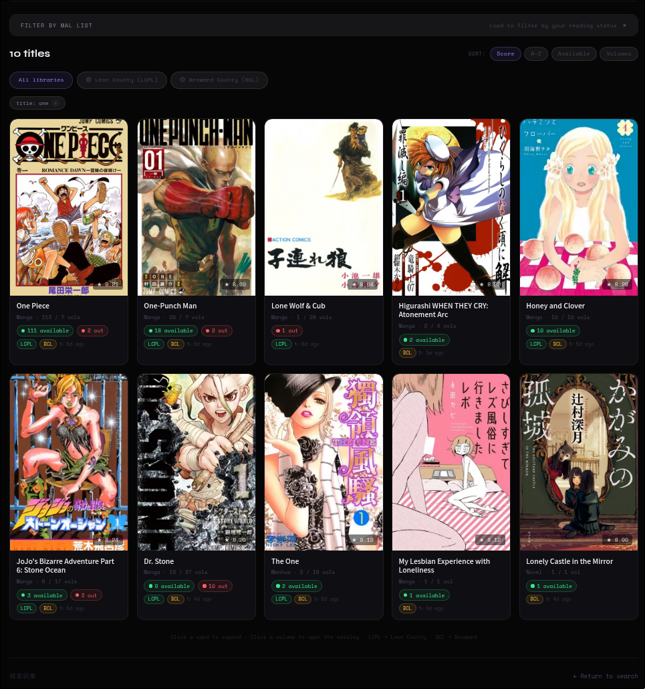
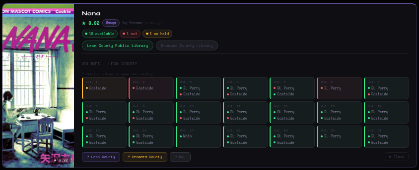
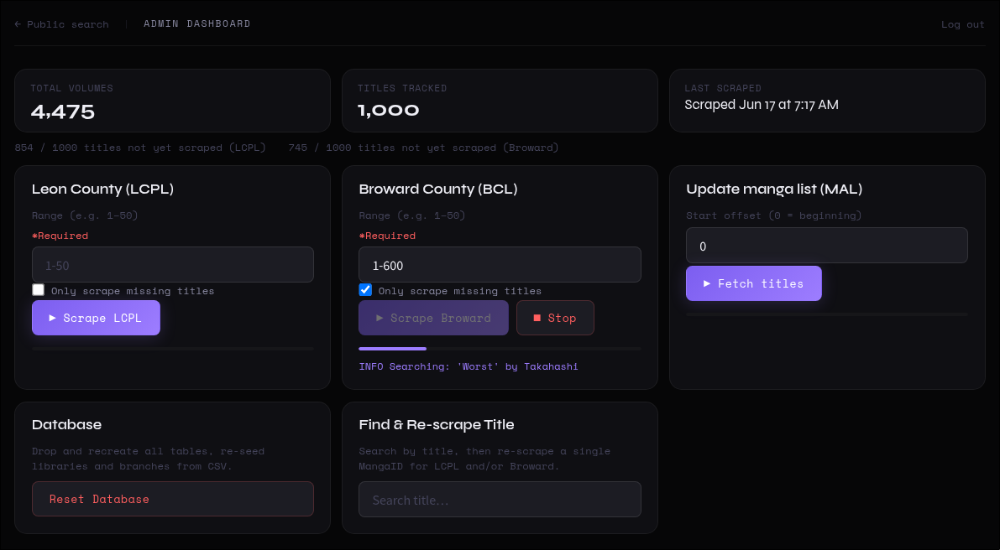
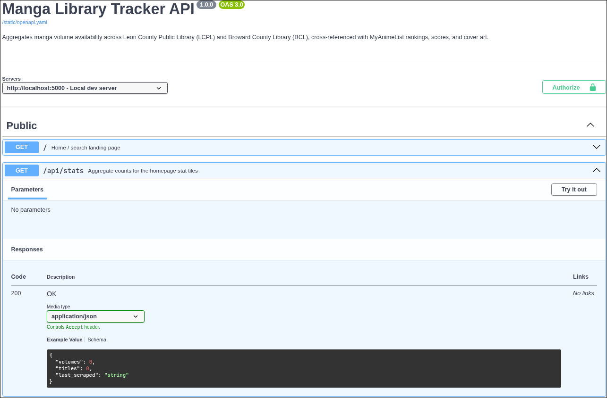

# Manga Library Tracker


A full-stack web application that aggregates manga and light novel availability across two Florida county library systems — **Leon County Public Library (LCPL)** and **Broward County Library (BCL)** — and cross-references it with MyAnimeList rankings, scores, and cover art.

**Live demo:** [manga-website.duckdns.org](https://manga-website.duckdns.org)

---

## Screenshots

<br>
*Instant search, live stats, and library/availability filters.*


*Results grid — type, volume count, score, and live per-library availability at a glance.*


*Expanded view — per-volume, per-branch availability across both library systems.*


*Admin dashboard — scrape controls, live job progress, and collection stats.*


*Auto-generated API docs via Swagger UI, served from a hand-written OpenAPI 3.0 spec.*

---

## What It Does

Most library catalogs are clunky, slow, and built for finding one book at a time. This app solves a specific problem: *"Which volumes of this manga series are available at my library right now, and at which branch?"* — answered across 500+ titles simultaneously, with real-time per-branch status.

---

## Features

**Public-facing**
- Instant title search with typeahead autocomplete (MySQL FULLTEXT, not a linear scan)
- Filter by type, branch, library system, and availability status
- Cover art, score, volume count, and author sourced from MyAnimeList
- Per-volume, per-branch availability grid for LCPL (7 branches) and BCL (37 branches)
- Optional MAL OAuth2 login to filter results by your own reading list status

**Admin dashboard** *(password-protected)*
- Three-stage data pipeline: fetch MAL rankings → scrape LCPL → scrape Broward
- Live job progress with stop controls, backed by a Redis/RQ queue — accurate no matter which Gunicorn worker handles the polling request
- Range and "only missing" targeting for incremental scrapes
- Re-scrape a single title
- Collection stats by branch/library, full job history log
- Two-click database reset with CSV re-seed

---

## Tech Stack

| Layer | Technology |
|---|---|
| Backend | Python · Flask |
| Database | MySQL |
| Job Queue | RQ + Redis — background scrape/MAL-fetch jobs, status shared across every Gunicorn worker |
| Migrations | Alembic |
| Scraping | Requests · BeautifulSoup |
| External APIs | MyAnimeList API v2 (OAuth2) · SirsiDynix ILSWS REST (LCPL) · SirsiDynix Enterprise AJAX (Broward) |
| Frontend | Vanilla JS (ES modules) · Jinja2 |
| Testing | pytest · mocked MySQL · real Redis for job-queue integration tests |
| CI/CD | GitHub Actions — ruff, mypy, pytest matrix across Python 3.11–3.13 |
| Containerization | Docker · docker-compose (Flask + MySQL + Redis + nginx) |

---

## Notable Engineering Decisions

A few problems worth calling out, since "it works" undersells what it took to get there:

- **Multi-worker job state.** The original job tracker was a plain dict in process memory, which only works with exactly one Gunicorn worker — `/api/job/<name>` has to land on the same process that started the job. Moved job state into Redis and the actual scrape execution into a separate `rq worker` process, so any worker (or container replica) can answer a status poll correctly.
- **Session storage race condition.** Bumping the Gunicorn worker count (now safe, since job state moved out of process memory) exposed a real bug: `cachelib.FileSystemCache`-backed sessions periodically sweep and unlink "expired" files, and two workers sweeping the same directory concurrently can unlink a file mid-read on another. Moved session storage to Redis, which handles concurrent access atomically.
- **MySQL FULLTEXT through a multi-table join.** Title search originally used `LIKE '%query%'`, which can't use any index and forces a full table scan on every keystroke. Switching to `MATCH() AGAINST() IN BOOLEAN MODE` with prefix truncation gets index-backed prefix search, but only if it runs as a subquery against the indexed table alone — left as a direct `MATCH()` in a four-table-join `WHERE` clause, MySQL's optimizer won't reliably push it through.
- **Migrations vs. the "Reset Database" button.** Schema changes go through Alembic, but the admin panel's full drop/reseed bypasses migrations entirely for fast dev resets — which leaves Alembic's bookkeeping table out of sync. A reset now explicitly stamps `alembic_version` at head afterward, or the next real migration tries to re-create tables that already exist.
- **Docker networking.** nginx resolves a literal hostname in `proxy_pass` once, at config-load time, and caches that IP for the life of the worker process. Rebuilding the `app` container hands it a new internal IP that nginx never finds out about — silent 502s. Fixed by routing through a variable so nginx re-resolves via Docker's embedded DNS on every request instead of once at startup.

---

## Getting Started

### With Docker (recommended)

```bash
cp .env.example .env       # fill in DB password, admin password, etc.
docker compose up --build
```

Starts `nginx`, `app` (gunicorn), `worker` (the RQ worker that runs scrapes), `db` (MySQL), and `redis`. Open `http://localhost`, log into `/admin`, and click **Reset Database** to create the schema and seed library/branch data.

**After changing code:** `docker compose up -d --build app worker` — both run the same image, so the worker needs rebuilding too or it'll keep executing stale scraper code. Static assets in `web/static/` are bind-mounted and update live with no rebuild.

### Without Docker

```bash
pip install -e .
# point a .env at a local MySQL instance: DB_HOST / DB_USER / DB_PASSWORD / DB_NAME
redis-server &
python web/backend.py
rq worker manga-jobs --url redis://localhost:6379/0   # second terminal
```

For a bare-metal production deployment, `manga.service`, `manga-worker.service`, and `manga.nginx` in the repo root show the systemd + nginx setup this app was originally built around.

---

## Testing

```bash
pip install -e ".[dev]"
redis-server &                                          # required for test_job_runner.py
pytest
pytest --cov=utils --cov=web --cov-report=term-missing
```

DB calls are mocked in `tests/conftest.py` — no live MySQL needed for most of the suite. `tests/test_job_runner.py` is the one exception, exercising a real Redis/RQ queue (CI spins one up as a service container automatically).

---

## Architecture

```
┌────────────────────────────────────────────────────────────┐
│              Flask App (N Gunicorn workers)                │
│  /search  /admin  /api/stats  /api/job/*  /api/suggestions │
└──────────────┬───────────────────────┬─────────────────────┘
               │                       │ enqueue job / poll status
    ┌──────────▼────────┐    ┌─────────▼─────────────────┐
    │   MySQL Database  │    │  Redis                    │
    │  manga            │    │  job:state:{name}  (HASH) │
    │  library          │    │  job:history       (LIST) │
    │  branch           │    │  manga-jobs        (queue)│
    │  availability     │    └─────────────┬─────────────┘
    │  branch_avail...  │                  │ dequeue
    └───────────▲───────┘        ┌─────────▼──────────────────┐
                │                │  rq worker process(es)     │
                └────────────────┤  get_manga.py              │
                                 │  leon_scraper.py           │
                                 │  broward_scraper.py        │
                                 └────────────────────────────┘
```

## Data Model

```
manga ─── availability ─── branch_availability_status ─── branch ─── library
```

Each `availability` row is one volume of one title; each `branch_availability_status` row is that volume's status at a specific branch.

## Scraping Strategy

**LCPL** uses the SirsiDynix ILSWS REST endpoint for structured JSON per catalog key, including per-branch item status. **Broward** reverse-engineers the two-step AJAX flow behind the SirsiDynix Enterprise catalog UI — an init POST to prime the session, then an availability POST returning available/total/hold counts. Both run inside an `rq worker` process, never inside a web request.

## Scale

- 7 LCPL branches, 37 BCL branches — full per-volume, per-branch status
- 500-title batches from MAL with automatic OAuth2 token refresh
- Incremental scraping via "only missing" mode
- Job state lives in Redis, not process memory — scales to multiple Gunicorn workers or container replicas with no stale status

---

## License

MIT — see [LICENSE](LICENSE).
